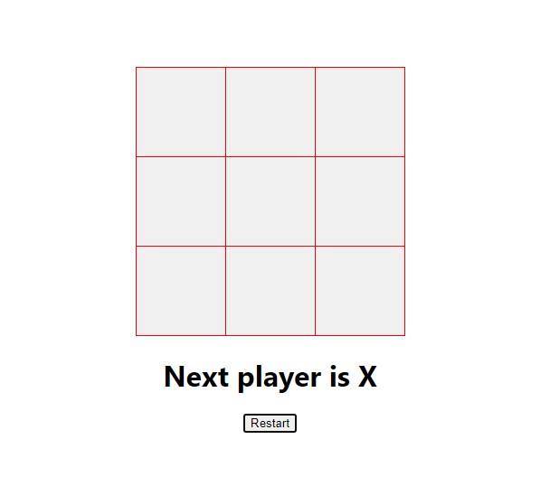
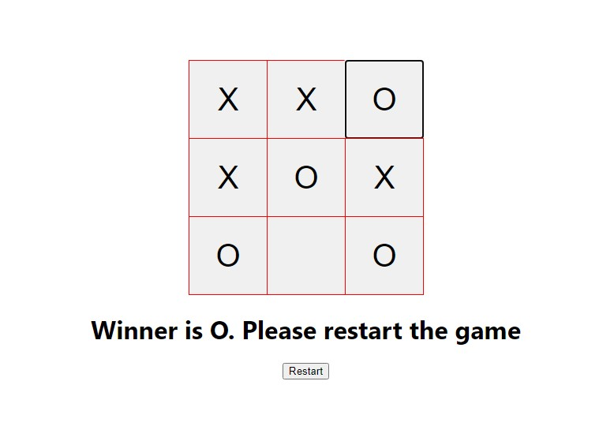
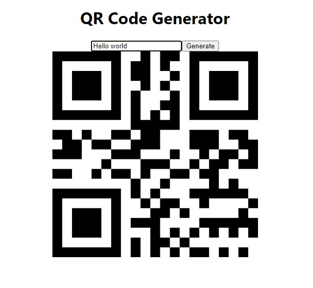

### Tic_Tac_Toe and QR Code Generator

## Tic Tac Toe

- A beginner project to using Reactjs and javascript to note the positons of the player X and O
- In JavaScript the Arrays are used to fill the positions of X and O with all combinations to get a straight or cross all same value for the win.
- a custom message to say the winner for respective player wins and a restart button to start the game once again

## QR Code Generator

- A simple designed QR Code Generator using ReactJs.
- This is a QR Code Generator for any word or sentences or Number to be generated using QR Code
- This uses a 3rd party library package and have been imported to use the QR Code.

